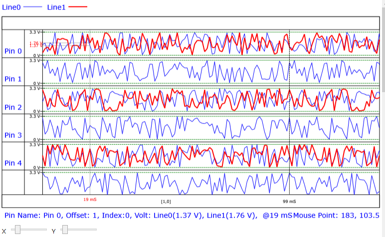

# Drawing Waveform With DrawingContext
Github: https://github.com/Jasson-Chou/DrawingWaveformSampleCode.git

### **Overview**

This project is a lightweight user control for drawing waveform diagrams. With simple configuration, real-time drawing functionality can be achieved. It also provides highly customizable display options, such as showing the position of Strobes in each Channel, displaying text in Cycles, and more.

---

### **Requirements**

- .NET Framework 4.8

---

### **Build & Run**

1. Open DrawingWaveformControlSolution.sln
2. Select Release | Debug and build
3. Run the program

---

### **Sample Code Explanation**

In the `MainWindow.xaml.cs` file of the `WaveformViewDemo` project, there is a simple sample program. The execution steps of the `GenBtn_Click` event are as follows:

1. Create lineProperties—two lines (blue and red), and configure their thickness and display properties.
2. Create cycleProperties—add CycleProperties for each cycle, with PointsSize determined by a random number.
3. Create pinProperties—create PinProperties for each pin, where each pin contains CycleResults for multiple cycles. Each point is filled with a random double-precision voltage value (ranging between MinVolt and MaxVolt), and even-numbered pins contain data for two lines.
4. Inject cycleProperties, pinProperties, and lineProperties into WaveformContext sequentially through wcInstance.Setup(...).
5. Configure SpacingProperties—including timing resolution (TimingResolution), timing unit (TimingUnit), and timing cursor name.
6. Use Dispatcher.Invoke to call wcInstance.Render(WaveformContext.ERenderDirect.All) on the UI thread to render the waveform.

---

### **Demo - Multi-channel Waveform View**

- Each row represents a Pin (Pin0 ~ Pin4).
- The waveform has two lines: Line0 (blue) and Line1 (red), which can be overlaid to display two sets of measurements for the same Pin.
- The Y-axis is marked with voltage, with dashed lines at 0 V and 3.3 V serving as references.
- The X-axis represents time, with scales and annotations at the bottom and middle (for example, 19 ms, 99 ms).
- The top-left corner has a legend indicating the line names and colors.
- The status bar at the bottom of the window displays real-time information corresponding to the cursor position: Pin name, Offset, Index, and the voltage values (Volts) of both lines at that point in time, along with the mouse coordinates.
- The X and Y sliders at the very bottom are used to pan or zoom the viewing range.



---

### **GUI Layout**

**Line Legend**


Displays the names of the lines at the top of the screen. Users can define the number of lines, their colors, names, and thickness.

**Pin (Channel)**

Displays user-defined pin names on the left side of the screen.


**Cycles**

Based on the time width defined by the user for each Cycle.


**Time Bar**

Located at the bottom of the screen, it displays Cycle time, mouse position time, and Timing Cursor time to help users identify specific time points.


**Voltage Bar**

Located on the left side of the screen, between the pin names and the waveform plot, 
it displays the voltage range being observed as well as annotations for the voltage value at the mouse cursor position.


**Cursor**

Add Timing Cursor, which can be repositioned by dragging with the mouse.


**Cursor Information**

- **Mouse Cursor**
Located at the very bottom of the screen, it displays the pin name currently pointed to by the mouse, Offset, Index, the voltage values of each line, and the corresponding time point.
    
    
    
- **Timing Cursor**
Located in the top-right corner of the screen, it displays the time difference between Timing Cursors.
    
    
    

**Waveform Plot**

Located in the center of the screen, displaying the voltage values of each pin at discontinuous but evenly spaced time intervals.


---

### **APIs** [Under Construction]

Waveform Context

```csharp
<Window ...
        xmlns:waveformView="clr-namespace:WaveformView;assembly=WaveformView"
        ...
        Title="MainWindow" Height="450" Width="800">
    <Grid>
        ...
        <waveformView:WaveformViewer x:Name="waveformViewer" Grid.Row="1"/>
    </Grid>
</Window>
```

```csharp
var wcInstance = waveformViewer.Instance;

//To Do...
//Setup Line, Cycle, Cursor...
```

**Line**

可自訂線條的數量、顏色、粗細及是否顯示

```csharp
//Quick Reference
var wcInstance = waveformViewer.Instance;

var lineProperties = new List<WaveformLineProperties>();

lineProperties.Add(new WaveformLineProperties("L0") {Thickness = 1.0d, LineColor = Colors.Blue, Show = true });
lineProperties.Add(new WaveformLineProperties("L1") { Thickness = 2.0d, LineColor = Colors.Red, Show = true });
lineProperties.Add(new WaveformLineProperties("L2") { Thickness = 0.5d, LineColor = Colors.Green, Show = true });
lineProperties.Add(new WaveformLineProperties("L3") { Thickness = 0.5d, LineColor = Colors.Orange, Show = true });

wcInstance.Setup(lineProperties);
```

**Mouse Cursor**

```csharp
// 目前尚未支援
// Currently not supported
```

**Timing Cursor**

Supports time difference calculation between up to two Cursors

```csharp
//Quick Reference
var wcInstance = waveformViewer.Instance;

// |X0 - X1| = 18 mS
wcInstance.SpacingProperties.TimingMeasurement.CursorName1 = "X0";
wcInstance.SpacingProperties.TimingMeasurement.CursorName2 = "X1";
```

Absolute difference between X0 and X1


Absolute difference between X0 and X1

How to add a Timing Cursor

```csharp
private void AddTimCursor_Click(object sender, RoutedEventArgs e)
{
    var wcInstance = ((App)App.Current).WCInstance;
    wcInstance.AddTimingCursor(); // add a timing cursor
}
```

How to remove a Timing Cursor

```csharp

private void RemoveTimingCursorByName(string name)
{
		var wcInstance = ((App)App.Current).WCInstance;
    var cursor = wcInstance.TimingCursors.FirstOrDefault(c => c.Name == name);
    if (cursor != null)
    {
        wcInstance.RemoveTimingCursor(cursor);
        wcInstance.Render(WaveformContext.ERenderDirect.All);
    }
}
```

**Jump**

```csharp
// JumpPinName(string pinName, out string errorMsg);
var wcInstance = ((App)App.Current).WCInstance;
var jumpPinName = "Pin 0";

if(!wcInstance.JumpPinName(jumpPinName , out string errorMsg))
{
		// To Do...
		// MessageBox.Show($"Jump Pin{jumpPinName} Error, {errorMsg}");
}
```

**Zoom In/Out**

```csharp
// Reset ZoomIn/Out
var wcInstance = ((App)App.Current).WCInstance;
wcInstance.ResetZoomInOut();
```

**Export Picture**

```csharp
var wcInstance = ((App)App.Current).WCInstance;
var dlg = new SaveFileDialog { Filter = "Image (png/bmp)|*.png;*.bmp", FileName = "waveform.png" };
if (dlg.ShowDialog() != true) return;

wcInstance.Render(WaveformContext.ERenderDirect.All);
// ExportToBitmap 目前使用 PNG 編碼器，所以副檔名建議使用 .png
// ExportToBitmap currently uses a PNG encoder, so it is recommended to use the .png file extension
wcInstance.ExportToBitmap(dlg.FileName);
```

```csharp
// Export Png
var wcInstance = ((App)App.Current).WCInstance;
var dlg = new SaveFileDialog { Filter = "PNG Image|*.png", FileName = "waveform.png" };
if (dlg.ShowDialog() != true) return;

wcInstance.Render(WaveformContext.ERenderDirect.All);
wcInstance.ExportToPNG(dlg.FileName);
```

```csharp
// Export Jpeg
var wcInstance = ((App)App.Current).WCInstance;
var dlg = new SaveFileDialog { Filter = "JPEG Image|*.jpg;*.jpeg", FileName = "waveform.jpg" };
if (dlg.ShowDialog() != true) return;

wcInstance.Render(WaveformContext.ERenderDirect.All);
wcInstance.ExportToJPEG(dlg.FileName);
```

---

### **Future Plans**

To improve the Demo functionality showcase, the Demo does not yet fully demonstrate all features.

- [x]  Improve the GUI Layout documentation
- [x]  Improve the APIs documentation
- [ ]  Add user-defined Channel quantity
- [ ]  Add user-defined Cycle quantity
- [ ]  Add user-defined number of points per Cycle
- [ ]  Add functionality to dynamically modify Channel and line names
- [ ]  Add Waveform auto-fit to screen functionality